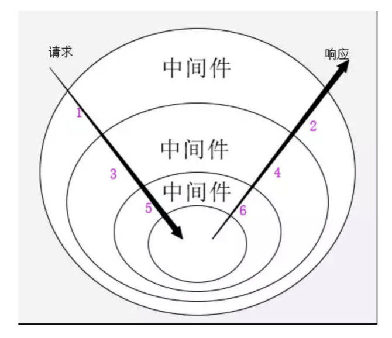

定义：

偏底层的无态度web框架

一个拥有洋葱模型中间件的http处理库，一个请求，经过一系列的中间件，最后生成响应

koa的大致实现原理：context上下文的保存与传递，中间件的管理和next方法的实现

大致过程：我们常用的app.use方法就是将一系列中间件的方法存进了数组，app.listen底层用http.createServer(this.callback())进行封装，传进createServer的回调函数通过compose来处理中间件集合（就是递归遍历中间件数组的过程），通过req，res（这两个对象封装了node的原生http对象）创建上下文，并返回一个处理请求的函数（参数是上下文，中间件集合（类似一个链表））