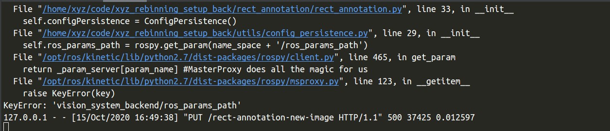
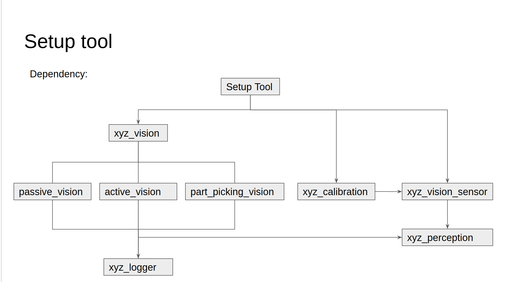
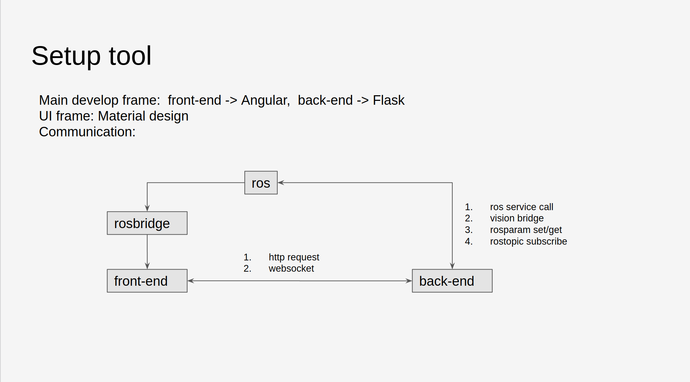

四元数介绍：

旋转是三种坐标变换（缩放、旋转、平移），中最复杂的一种了，有一种旋转的方法叫做四元数，这边还有另外两种旋转的方法（矩阵旋转、欧拉旋转）

矩阵旋转：使用4*4大小的矩阵来表示任意轴旋转的变换矩阵

欧拉旋转：按照一定的坐标轴顺序（例如：先x，再y，最后z）、每个轴旋转一定的角度来变换坐标或向量，实际上是一系列坐标旋转的组合

四元数：本质上是一种高阶复数，是一个四维空间 ，虚部，x = a + bi + cj + dk

q = x + xi + yj + zk    =》 q = ((x,y,z),w) = (v,w)， 其中v是向量，w是实数


visor sensor 编译：catkin_make -DCATKIN_WHITELIST_PACKAGES="xyz_vision_sensor" 


'rosrun', 'xyz_vision_sensor', 'xyz_vision_sensor_node', '--noHikvision'


```python
# app_path = os.popen('readlink which $CODE_BASE/app').read().strip()
```


标注：训练模板


问题：切换到标注页面，标注相机的图片卡住报错




### 工业机器人的工作中心点：

机器人要完成指定的生产任务，就会在机械臂的末端固定一个工具，比如：焊枪、胶枪、夹具、吸盘等，但是这些工具的形状大小各不相同，就产生一个问题，如何选择一个点代表整个工具呢（机器人工具中心点）Tool Central Point 简写TCP。

初始状态的工具中心点是工具坐标系的原点。当我们以手动或编程的方式让机器人去接近空间的某一点时，其本质就是让工具中心点去接近该点。

机器人的工具一般可以分为两大类：夹具、枪类


### 摄像机标定：

我们平常的拍照，得到的只是一堆感兴趣的像素而已，怎么样才能把这些像素转化到显示世界的对象中呢？也就是说，究竟要怎样对这些仅存在于图像中的东西进行测量，才能得到具有实际意义的尺寸的数据呢。此为摄像机标定存在的意义。


首先：了解一下通过摄像机标定我们可以得到些什么：

1、外参数矩阵（告诉你现实世界点（世界坐标）是怎样经过旋转、平移，然后落到另一个现实世界点（摄像机坐标上））

2、内参数矩阵（告诉你上述那个点在1的基础上，是如何继续经过摄像机镜头、并通过针孔成像和电子转化而成为像素的）

3、畸变矩阵（告诉你为什么上面那个像素并没有落在理论计算该落在的位置上，还产生了一定的偏移和变形）


内参：

只由相机决定，不会因为外部环境而改变


```
rosparam set /vision_system_backend/ ''
rosparam get /vision_system_backend
```


```python
@socketio.on('error')
def test_error():
    print 'error'

@socketio.on_error()
def error_handler(e):
    print('error')
    print (e)


@socketio.on_error_default
def default_error_handler(e):
    print ('error default')
    print (e)
```


通信协议XYZ机器人视觉系统为各种机器人应用程序提供了底层TCP套接字通信。协议XYZ机器人视觉系统是一个TCP服务器，监听端口54321。所有消息都按网络字节序（Big Endian）排列。数据类型参考C编程语言定义。常量
名称值KEEP_ALIVE0CAPTURE_BLANK_WORKSPACE1FIND_OBJECTS2REQUEST_OBJECTS_FINDING3OBJECTS_FINDING_RESPONSE4STATUS_OK1STATUS_FAIL0SCALE_FACTOR100000
消息格式请求报文。struct client_to_vision_system {  unsigned char cmd;  unsigned char workspace;};
回应报文。struct vision_system_to_client { int status; int best_point [3]; int second_candidate_point [3];};
通信命令获取空白工作空间。客户端发送此命令获取空白工作区快照。该快照播放用于物体识别的参考背景噪声过滤。通常用户端只需执行一次此命令。如果工作环境，比如灯光照明有明显变化，才需要再次执行获取空白工作区快照。请求数据结构如下。
请求类型描述CAPTURE_BLANK_WORKSPACEunsigned char从客户端发送到视觉系统的一字节请求。工作区Unsigned char炒锅空间ID（）
响应类型描述statusint视觉系统返回STATUS_OK或STATUS_FAIL0〜8best_pointint [3]{0，0，0}second_candidate_pointint [3]{0，0，0}
查找对象。客户端发送该命令查询抓取对象所在的位置。通常，它将返回具有最高置信度的“最佳”点和具有较低置信度的“第二候选”点。这是一个同步请求，这意味着它将阻塞调用者，直到找到对象为止。
请求类型描述FIND_OBJECTSunsigned char从客户端向视觉系统发送的一字节请求。工作区Unsigned char工作空间ID（）

0〜8best_point和second_candidate_point中的值在视觉系统中按比例放大为整数。客户端必须将X，Y，Z除以SCALE_FACTOR，以获得以浮点数表示的米为单位的检测对象的位置。
响应值描述状态STATUS_OK / STATUS_FAILSTATUS FAIL指示未检测到对象。best_point [3][X，Y，Z]。 （米）best_point [0]，best_point [1]和best_point [2]是相对于机器人世界框架的X，Y，Z坐标。second_candidate_point [3][X，Y，Z]或[0，0，0]该点的定义与“ best_point”相同。如果客户难以掌握best_point，它可以提供第二要点。全零表示没有可用的候选者。
请求查找对象。类似于 [2查找对象](https://docs.google.com/document/d/1hwnXgGCzoIl-p5Z45SS5ja6t0_wYHUUET4L77U8lDrQ/edit#bookmark=id.8zigkr6h6a5b) 上面的。但是，这是一个非阻塞调用，它将立即返回而不会检测到对象。它只是在后台触发对象检测。用户必须调用 [4获取发现对象响应](https://docs.google.com/document/d/1hwnXgGCzoIl-p5Z45SS5ja6t0_wYHUUET4L77U8lDrQ/edit#bookmark=id.hb48yep9hqtq) 以检索检测到的对象的坐标。
请求类型描述REQUEST_OBJECTS_FINDINGunsigned char从客户端向视觉系统发送的一字节请求。工作区Unsigned char工作空间ID（）

响应类型描述statusint视觉系统返回STATUS_OK或STATUS_FAIL0〜8best_pointint [3]{0，0，0}second_candidate_pointint [3]{0，0，0}
获取查找对象响应。此命令是在之后获取检测到的对象的后续操作 [3个请求查找对象](https://docs.google.com/document/d/1hwnXgGCzoIl-p5Z45SS5ja6t0_wYHUUET4L77U8lDrQ/edit#bookmark=id.n5bn83shvl6w) 已经发送。
请求类型描述OBJECTS_FINDING_RESPONSEunsigned char从客户端发送到视觉系统的一字节请求。工作区无符号字符工作空间ID（）

响应值描述状态0〜8STATUS_OK / STATUS_FAILSTATUS FAIL表示未检测到对象。best_point [3][X，Y，Z]。 （米）best_point [0]，best_point [1]和best_point [2]是相对于机器人世界框架的X，Y，Z坐标。second_candidate_point [3][X，Y，Z]或[0，0，0]该点的定义与“ best_point”相同。如果客户难以掌握best_point，它可以提供第二要点。全零表示没有可用的候选者。
的示例代码在Python示例代码
''”进口SYS进口插座进口结构

CMD_KEEPALIVE = 0CMD_CAPTURE_BLANK_WORKSPACE = 1CMD_FIND_OBJECTS = 2CMD_REQUEST_OBJECTS_FINDING = 3CMD_OBJECTS_FINDING_RESPONSE = 4
RESP_STATUS_OK = 1RESP_STATUS_FAIL = 0
SCALE_FACTOR = 100000.0
MAX_MESSAGE_SIZE = 28
“””在C请求structized格式struct client_to_vision_system { unsigned char cmd; unsigned char工作区；}

以C结构化格式响应struct vision_system_to_client { int status; int best_point [3]; int second_candidate_point [3];}“”“

def get_input（prompt）：  如果sys.version_info> =（3，）：    返回输入（提示）
  返回raw_input（提示）

def capture_blank_background（sock）：  工作区= get_input（'请输入工作区：'）  sock.sendall（struct.pack（'BB'，               CMD_CAPTURE_BLANK_WORKSPACE，               int（workspace） ）               ）         ）  print（'\ r \ n'）
  resp = sock.recv（MAX_MESSAGE_SIZE）  status = struct.unpack（'！7i'，resp）  if status [0] == RESP_STATUS_OK：    print（'获取工作区的空白背景{}成功！'。format（有效步调））  否则：    print（'无法获取工作空间{}'。format（workspace）的空白背景）
  print（'\ r \ n \ r \ n'）
  返回

def find_objects（sock）：  工作空间= get_input（'请输入工作区：'）  sock.sendall（struct.pack（'BB'，               CMD_FIND_OBJECTS，               int（workspace）               ）         ）  print（'\ r \ n'）
  resp = sock.recv（MAX_MESSAGE_SIZE）  data = struct.unpack（'！ 7i'，分别）  如果data [0] == RESP_STATUS_FAIL：    print（'无法获取对象在工作空间{}'。format（workspace））中的    print（'\ r \ n \ r \ n'）    返回
  first_point = {    'x'：数据[1] / SCALE_FACTOR，    'y'：数据[2] / SCALE_FACTOR，    'z'：数据[3] / SCALE_FACTOR  }  second_candidate_point = {    'x'：数据[4] / SCALE_FACTOR，    'y' ：data [5] / SCALE_FACTOR，    'z'：data [6] / SCALE_FACTOR  }  print（first_point）  print（second_candidate_point）  print（'\ r \ n \ r \ n'）
  return

def async_find_objects（sock）：  工作空间= get_input （'请输入工作空间：'）  sock.sendall（struct.pack（'BB'，               CMD_REQUEST_OBJECTS_FINDING，               int（workspace）               ）         ）  print（'\ r \ n'）
  resp = sock.recv（MAX_MESSAGE_SIZE）  status = struct.unpack （'！7i'，r esp）  如果status [0] == RESP_STATUS_OK：    print（'请求成功在工作空间{}中找到对象！'。format（workspace））  else：    print（'在工作空间{}中未能找到对象'.format（workspace））
  print（'\ r \ n \ r \ n'）
  return

def async_get_objects_position（sock）：  工作空间= get_input（'请输入工作空间：'）  sock.sendall（struct.pack（'BB'，               CMD_OBJECTS_FINDING_RESPONSE，               int（workspace）               ））         ）  print（'\ r \ n'）
  resp = sock.recv（MAX_MESSAGE_SIZE）  data = struct.unpack（'！7i'，resp）  如果data [0] == RESP_STATUS_FAIL：    print（'无法获取对象在工作空间中的位置{}'。format（workspace））    print（'\ r \ n \ r \ n'）    返回
  first_point = {    'x'：data [1] / SCALE_FACTOR，    'y'：data [2] / SCALE_FACTOR，    'z '：数据[3] / SCALE_FACTOR  }  second_candidate_point = {    'x'：数据[4] / SCALE_FACTOR，    'y'：数据[5] / SCALE_FACTOR，    'z'：数据[6] / SCALE_FACTOR  }  打印（first_point）  打印（second_candidate_point）  print（'\ r \ n \ r \ n'）  return

def main（）：  server_addr = get_input（'请输入服务器IP：'）  try：    s = socket.create_connection（（（server_addr ，54321），6），  除了socket.error以外为err：    print（err）    返回，
  而True：    print（'1.捕获空白背景\ r \       .查找对象\ r \       n''2n''3.要求找到对象（立即返回）\ r \       通过先前的请求获取找到的对象（立即返回）\ r \       .退出\ r \ n'）
    n''4.n''5option = get_input（'请选择：'）    如果选择=，='5'：      中断    elif选项=='1'：      capture_blank_background（s）    elif选项=='2'：      find_objects    elif选项=='3'：      async_find_objects（s）    elif选项=='4'：      async_get_objects_position（s）    else：      继续
  s.close（）  返回

如果__name__ =='__main__'：  main（）
'''

```
通信协议
XYZ机器人视觉系统为各种机器人应用程序提供了底层TCP套接字通信。
协议
XYZ机器人视觉系统是一个TCP服务器，监听端口54321。
所有消息都按网络字节序（Big Endian）排列。
数据类型参考C编程语言定义。
常量

名称
值
KEEP_ALIVE
0
CAPTURE_BLANK_WORKSPACE
1
FIND_OBJECTS
2
REQUEST_OBJECTS_FINDING
3
OBJECTS_FINDING_RESPONSE
4
STATUS_OK
1
STATUS_FAIL
0
SCALE_FACTOR
100000

消息格式
请求报文。
struct client_to_vision_system {
    unsigned char cmd;
    unsigned char workspace;
};

回应报文。
struct vision_system_to_client {
  int status;
  int best_point [3];
  int second_candidate_point [3];
};

通信命令
获取空白工作空间。客户端发送此命令获取空白工作区快照。该快照播放用于物体识别的参考背景噪声过滤。通常用户端只需执行一次此命令。如果工作环境，比如灯光照明有明显变化，才需要再次执行获取空白工作区快照。请求数据结构如下。

请求
类型
描述
CAPTURE_BLANK_WORKSPACE
unsigned char
从客户端发送到视觉系统的一字节请求。
工作区
Unsigned char
炒锅空间ID（）

响应
类型
描述
status
int
视觉系统返回STATUS_OK或STATUS_FAIL
0〜8best_point
int [3]
{0，0，0}
second_candidate_point
int [3]
{0，0，0}

查找对象。客户端发送该命令查询抓取对象所在的位置。通常，它将返回具有最高置信度的“最佳”点和具有较低置信度的“第二候选”点。这是一个同步请求，这意味着它将阻塞调用者，直到找到对象为止。

请求
类型
描述
FIND_OBJECTS
unsigned char
从客户端向视觉系统发送的一字节请求。
工作区
Unsigned char
工作空间ID（）


0〜8best_point和second_candidate_point中的值在视觉系统中按比例放大为整数。客户端必须将X，Y，Z除以SCALE_FACTOR，以获得以浮点数表示的米为单位的检测对象的位置。

响应
值
描述
状态
STATUS_OK / STATUS_FAIL
STATUS FAIL指示未检测到对象。
best_point [3]
[X，Y，Z]。 （米）
best_point [0]，best_point [1]和best_point [2]是相对于机器人世界框架的X，Y，Z坐标。
second_candidate_point [3]
[X，Y，Z]或[0，0，0]
该点的定义与“ best_point”相同。如果客户难以掌握best_point，它可以提供第二要点。全零表示没有可用的候选者。

请求查找对象。类似于 2查找对象 上面的。但是，这是一个非阻塞调用，它将立即返回而不会检测到对象。它只是在后台触发对象检测。用户必须调用 4获取发现对象响应 以检索检测到的对象的坐标。

请求
类型
描述
REQUEST_OBJECTS_FINDING
unsigned char
从客户端向视觉系统发送的一字节请求。
工作区
Unsigned char
工作空间ID（）


响应
类型
描述
status
int
视觉系统返回STATUS_OK或STATUS_FAIL
0〜8best_point
int [3]
{0，0，0}
second_candidate_point
int [3]
{0，0，0}

获取查找对象响应。此命令是在之后获取检测到的对象的后续操作 3个请求查找对象 已经发送。

请求
类型
描述
OBJECTS_FINDING_RESPONSE
unsigned char
从客户端发送到视觉系统的一字节请求。
工作区
无符号字符
工作空间ID（）


响应
值
描述
状态
0〜8STATUS_OK / STATUS_FAIL
STATUS FAIL表示未检测到对象。
best_point [3]
[X，Y，Z]。 （米）
best_point [0]，best_point [1]和best_point [2]是相对于机器人世界框架的X，Y，Z坐标。
second_candidate_point [3]
[X，Y，Z]或[0，0，0]
该点的定义与“ best_point”相同。如果客户难以掌握best_point，它可以提供第二要点。全零表示没有可用的候选者。

的示例代码
在Python示例代码

''”
进口SYS
进口插座
进口结构


CMD_KEEPALIVE = 0
CMD_CAPTURE_BLANK_WORKSPACE = 1
CMD_FIND_OBJECTS = 2
CMD_REQUEST_OBJECTS_FINDING = 3
CMD_OBJECTS_FINDING_RESPONSE = 4

RESP_STATUS_OK = 1
RESP_STATUS_FAIL = 0

SCALE_FACTOR = 100000.0

MAX_MESSAGE_SIZE = 28

“””
在C请求structized格式
struct client_to_vision_system {
  unsigned char cmd;
  unsigned char工作区；
}


以C结构化格式响应
struct vision_system_to_client {
  int status;
  int best_point [3];
  int second_candidate_point [3];
}
“”“


def get_input（prompt）：
    如果sys.version_info> =（3，）：
        返回输入（提示）

    返回raw_input（提示）


def capture_blank_background（sock）：
    工作区= get_input（'请输入工作区：'）
    sock.sendall（struct.pack（'BB'，
                             CMD_CAPTURE_BLANK_WORKSPACE，
                             int（workspace） ）
                             ）
                 ）
    print（'\ r \ n'）

    resp = sock.recv（MAX_MESSAGE_SIZE）
    status = struct.unpack（'！7i'，resp）
    if status [0] == RESP_STATUS_OK：
        print（'获取工作区的空白背景{}成功！'。format（有效步调））
    否则：
        print（'无法获取工作空间{}'。format（workspace）的空白背景）

    print（'\ r \ n \ r \ n'）

    返回


def find_objects（sock）：
    工作空间= get_input（'请输入工作区：'）
    sock.sendall（struct.pack（'BB'，
                             CMD_FIND_OBJECTS，
                             int（workspace）
                             ）
                 ）
    print（'\ r \ n'）

    resp = sock.recv（MAX_MESSAGE_SIZE）
    data = struct.unpack（'！ 7i'，分别）
    如果data [0] == RESP_STATUS_FAIL：
        print（'无法获取对象在工作空间{}'。format（workspace））中的
        print（'\ r \ n \ r \ n'）
        返回

    first_point = {
        'x'：数据[1] / SCALE_FACTOR，
        'y'：数据[2] / SCALE_FACTOR，
        'z'：数据[3] / SCALE_FACTOR
    }
    second_candidate_point = {
        'x'：数据[4] / SCALE_FACTOR，
        'y' ：data [5] / SCALE_FACTOR，
        'z'：data [6] / SCALE_FACTOR
    }
    print（first_point）
    print（second_candidate_point）
    print（'\ r \ n \ r \ n'）

    return


def async_find_objects（sock）：
    工作空间= get_input （'请输入工作空间：'）
    sock.sendall（struct.pack（'BB'，
                             CMD_REQUEST_OBJECTS_FINDING，
                             int（workspace）
                             ）
                 ）
    print（'\ r \ n'）

    resp = sock.recv（MAX_MESSAGE_SIZE）
    status = struct.unpack （'！7i'，r esp）
    如果status [0] == RESP_STATUS_OK：
        print（'请求成功在工作空间{}中找到对象！'。format（workspace））
    else：
        print（'在工作空间{}中未能找到对象'.format（workspace））

    print（'\ r \ n \ r \ n'）

    return


def async_get_objects_position（sock）：
    工作空间= get_input（'请输入工作空间：'）
    sock.sendall（struct.pack（'BB'，
                             CMD_OBJECTS_FINDING_RESPONSE，
                             int（workspace）
                             ））
                 ）
    print（'\ r \ n'）

    resp = sock.recv（MAX_MESSAGE_SIZE）
    data = struct.unpack（'！7i'，resp）
    如果data [0] == RESP_STATUS_FAIL：
        print（'无法获取对象在工作空间中的位置{}'。format（workspace））
        print（'\ r \ n \ r \ n'）
        返回

    first_point = {
        'x'：data [1] / SCALE_FACTOR，
        'y'：data [2] / SCALE_FACTOR，
        'z '：数据[3] / SCALE_FACTOR
    }
    second_candidate_point = {
        'x'：数据[4] / SCALE_FACTOR，
        'y'：数据[5] / SCALE_FACTOR，
        'z'：数据[6] / SCALE_FACTOR
    }
    打印（first_point）
    打印（second_candidate_point）
    print（'\ r \ n \ r \ n'）
    return


def main（）：
    server_addr = get_input（'请输入服务器IP：'）
    try：
        s = socket.create_connection（（（server_addr ，54321），6），
    除了socket.error以外为err：
        print（err）
        返回，

    而True：
        print（'1.捕获空白背景\ r \
              .查找对象\ r \
              n''2n''3.要求找到对象（立即返回）\ r \
              通过先前的请求获取找到的对象（立即返回）\ r \
              .退出\ r \ n'）

        n''4.n''5option = get_input（'请选择：'）
        如果选择=，='5'：
            中断
        elif选项=='1'：
            capture_blank_background（s）
        elif选项=='2'：
            find_objects
        elif选项=='3'：
            async_find_objects（s）
        elif选项=='4'：
            async_get_objects_position（s）
        else：
            继续

    s.close（）
    返回


如果__name__ =='__main__'：
    main（）

'''

```

![(/home/xyz/Pictures/object-annotation.png)


```
 <h2 class="mat-h2 configuration-title" i18n>Annotation Configurations</h2>
  <div class="vision-type">
    <mat-form-field>
      <mat-label i18n="@@vision-type">Vision Type</mat-label>
      <mat-select [(value)]="currentVisionType">
        <mat-option *ngFor="let visionType of visionTypeList" [value]="visionType">
          {{visionType}}
        </mat-option>
      </mat-select>
    </mat-form-field>
  </div>
</div>
```


更改电脑IP

```
nmcli connection modify ToLan ipv4.addresses 192.168.1.192 ipv4.gateway 192.168.1.1 ipv4.method manual
```


### calibration 初始化出错：

的情况下，可以看看这个包有没有装

```
sudo apt-get install ros-kinetic-genpy
```


### 个人总结xyz_apt使用方法：

​	

先装这个

注意：

```
apt install aptitude
```


1、下载应用软件xyz_apt.zip并解压缩到/bin/底下

https://drive.google.com/file/d/1MTy5h0DEeGpGg3A9BJeFozwwkLwZ4EFF/view

```
sudo mv xyz_apt /bin/
```


2、建立xyz_apt_server 安全连接与绑定

```python
sudo xyz_apt aet_up_account


用户名： xyzuigroup
密码：	robot2018sh
url：  161.189.84.82:8003/release
```


3、更新apt

```
sudo xyz_apt update
```

4、安装指定包

```
sudo xyz_apt install {package name}

这边安装的话，如果当前的包有依赖包的话，会询问是否一起安装，一般情况下一起安装

sudo xyz_apt install {package name = version 版本号}
```


5、删除包

```
sudo xyz_apt remove {package name}

删除指定包

sudo xyz_apt autoremove {package name}

删除包以及依赖包以及无用包
```


6、查看当前安装的xyz包

```
dpkg -l | grep xyz
```


7、查看想要安装包的版本号list

```
sudo xyz_apt list -a xyz-part-picking-vision


这样就可以看到part picking现有的版本号
```








1、yaml 文件 修改数据 方法


## 更改pman

终端中键入：

```
activate_app  配置包名
再rebash一下
```


## 更改rosparam 参数

```
rosparam set vision_system_backend ''
```


终端获取三维视角数据：

```
rostopic echo /xyz_calibration_marker_array
```


```python
def get_camera_index_in_local_config(self, camera_serial_num, tote_id):
    resp = {
        'state': False,
        'index': 0
    }
    if not os.path.exists(self.workspace_config_file):
        return resp

    with open(self.workspace_config_file, 'r') as workspace_config_file:
        workspaces_data = json.load(workspace_config_file)
    try:
        for workspace in workspaces_data['workspace_config']:
            if int(workspace['id']) == int(tote_id):
                for camera in workspace['cameras']:
                    if camera['serial_number'] == camera_serial_num:
                        resp['state'] = True,
                        resp['index'] = camera['camera_idx']
                        break
                break
    except KeyError:
        return resp
    return resp
```


rosparams_backend.json数据丢失情况

先把ros关了，再去关setup tool 后端，在setup tool 后端关闭前，会去拿ros里的数据存入.json文件中，如果把ros关掉的情况下，就拿不到ros中的数据，这样的话json文件就是空的


开机的时候会把文件夹里的数据存入ros params中


save params的时候会用ros的数据把原来文件中的数据替换掉，


传感器


```
['drawLine', 'drawCircle', 'drawRect', 'removePoint', 'addPoint'];
```


# app 指令合集

add_app   [custom app name]  添加app


del_app [app name]   删除app


activate_app [app name]  切换app


listapps    列举app


rosrun xyz_part_picking_vision tote_depalletizer -c /home/xyz/xyz_app/catkin_ws/src/xyz_app_config/template_app/vision/vision_config.yml --offline


# vision_config

vision config中的sensor是在绑定相机的时候加进去的

但是删除相机获取删除工作空间的时候不会去删除vision config 中sensor的数据


# setup tool

如果使用fakesingernal的话，机器人ip就是127.0.0.1


示教器更改系统：备份与恢复改成2.24_1版本的


### setup tool 后端代码安装依赖

```
pip install -r requirements.txt
```


```python
    def add_combination_camera_info_to_workspace_json(self, data):
        resp = {
            'state': False,
            'msg': ''
        }
        tote_file = app_path + '/ui/workspaces.json'
        if not os.path.exists(tote_file):
            resp['msg'] = 'can not find workspaces.json file'
            return resp
        try:
            with open(tote_file, 'r') as tote_stream:
                tote_info = json.load(tote_stream)
            if 'all_combination_camera_list' not in tote_info:
                tote_info['all_combination_camera_list'] = [data['Tuyang'] + '-' + data['hikvision']]
            else:
                for combination_camera in tote_info['all_combination_camera_list']:
                    if combination_camera.split('-')[0] == data['Tuyang']:
                        tote_info['all_combination_camera_list'].remove(combination_camera)
                tote_info['all_combination_camera_list'].append(data['Tuyang'] + '-' + data['hikvision'])

            target_workspace = {}
            for workspace in tote_info['workspace_config']:
                if int(workspace['id']) == int(data['workspaceId']):
                    target_workspace = workspace
                    break
            if 'combination_camera' not in target_workspace:
                target_workspace['combination_camera'] = [data['Tuyang'] + '-' + data['hikvision']]
            else:
                for item in target_workspace['combination_camera']:
                    if item.split('-')[0] == data['Tuyang']:
                        target_workspace['combination_camera'].remove(item)
                target_workspace['combination_camera'].append(data['Tuyang'] + '-' + data['hikvision'])

        except ValueError as e:
            print ('except error: ', e)
            resp['msg'] = 'workspaces.json file is empty'
            return resp

        with open(tote_file, 'w') as data_file:
            json.dump(tote_info, data_file, indent=4)

        resp['state'] = True
        return resp
```


a、选择需要进行验证的相机。 

b、移动机械臂使得整个标定板图案在相机视野中（若使用的是3D相机，则需同时能够看到标定板的点云）。 

c、点击“显示”按钮可以看到2D相机图片和3D场景中出现的坐标轴“board_array”。 

d、若2D相机图片中红色点和绿色点重合度较好（若使用 3D相机，则需依照2D图片中国显示的坐标轴和标定板图案的位置关系，来验证3D场景中的坐标轴“board_array”和标定板点云位置是否匹配），则可以初步说明标定结果满足需求。  

 


```
ipPattern = '^(([0-9]|[1-9][0-9]|1[0-9]{2}|2[0-4][0-9]|25[0-5])\\.){3}([0-9]|[1-9][0-9]|1[0-9]{2}|2[0-4][0-9]|25[0-5])$';


(
(
[0-9]|
[1-9][0-9]|
1[0-9]{2}|
2[0-4][0-9]|
25[0-5]
)\\.
)
{3}(
[0-9]|
[1-9][0-9]|
1[0-9]{2}|
2[0-4][0-9]|
25[0-5])
```


## 跑part picking的时候记得装 xyz-learning-bridge


### test_reset_camera


## get|set rosparam

rosparam get /vision_system_backend/vision_config_file