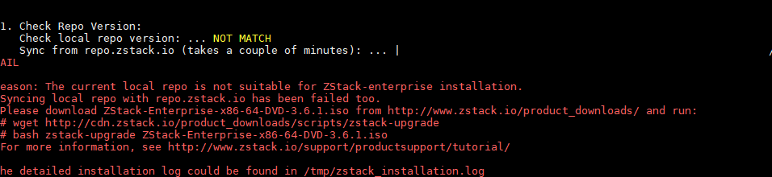
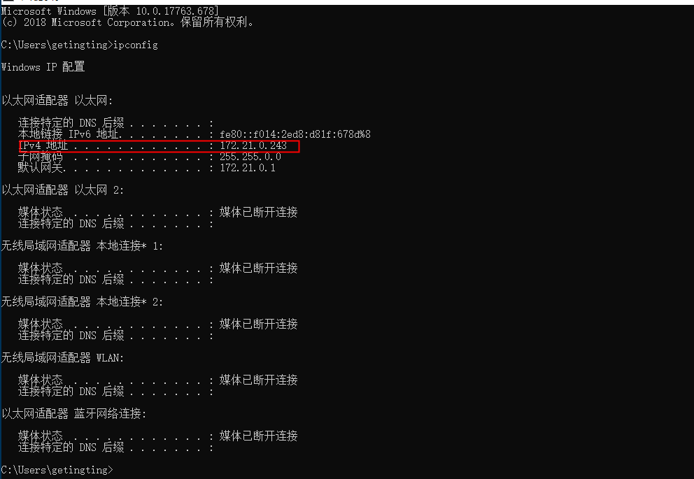
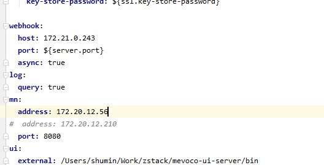
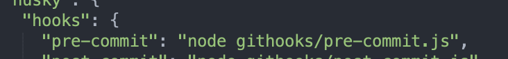
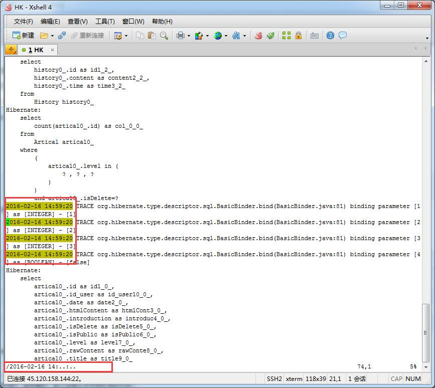

# 一、常用链接

http://172.20.12.174/wiki/wiki.php

0.254账号名和密码： admin       zstack.172.24.0.254 

0.10账号名和密码： admin       ZStack%SHYZ_6#418 

0.10的cli password： ZStack.7499_172.20.0.10 

 vcenter的配置：172.20.57.11 、172.20.57.1  密码：Testing%123 

自助申请license页面：http://172.20.12.1:9000/

环境升级：http://result.zstack.io/build/?buildtype=zstack_master

镜像（zstack自己的）： http://172.20.198.234/mirror/

镜像（非zstak自己的）：

查上周fix的bug数：status in (Resolved, Closed) AND resolutiondate >= -1w AND assignee = 

查看单测是否没有跑过:    http://test.zstack.io/#/overview

查看自己的bug： http://jira.zstack.io/secure/Dashboard.jspa?selectPageId=10402

力扣：https://leetcode-cn.com/     解题，可以练算法

个人感觉看知名开源库的源码再结合youtube的视频是最快的提升方式


# 二、环境升级

bin包链接：http://result.zstack.io/build/?buildtype=zstack_master

镜像链接：http://172.20.198.234/mirror/

#### 步骤：

##### 正常升级：

wget     http://172.20.198.234/mirror/zstack_master/442/ZStack-enterprise-installer-HEAD-1906190644-442.bin

bash    ZStack-enterprise-installer-HEAD-1906190644-442.bin  -u

##### 若失败，则删数据库，重新来过

rm -rf  /usr/local/zstack

bash    ZStack-enterprise-installer-HEAD-1906190644-442.bin  -D

##### 若遇到因为镜像而升级失败的问题，则按照提示进行




# 三、环境部署

### 1、ceph环境部署

http://ee.zstack.io/wiki/wiki.php?id=test:%E4%B8%80%E9%94%AE%E9%83%A8%E7%BD%B2%E4%B8%89%E8%8A%82%E7%82%B9ceph%E9%9B%86%E7%BE%A4

### 2、普通环境部署

在0.10上选择iso的镜像，会让选择磁盘容量

### 3、搭建SharedBlock主存储

http://confluence.zstack.io/pages/viewpage.action?pageId=67174780

==注意事项：==

==1：在虚拟主机创建好以后，要重启一下云主机，否则查看不到添加的盘符==

==2：如果在install  targetcli的时候，遇到说没有包的问题，可以参考黄浩的解决方法==

https://note.youdao.com/ynoteshare1/index.html?id=d52f0b4d946823ac2b520b8adf1e9b1c&type=note

```
[root@10-0-14-160 ~]#  yum install targetcli
Loaded plugins: fastestmirror
Loading mirror speeds from cached hostfile
No package targetcli available.
Error: Nothing to do
```

解决方法：

[root@zstack ~] # yum repolist                                #列出了当前系统上的全部的repo

中科大的yum：https://mirrors.ustc.edu.cn/

https://mirrors.ustc.edu.cn/help/centos.html


 [root@zstack ~] # cd /etc/yum.repos.d/                               #repo的文件所在地

 [root@zstack yum.repos.d]# vim base.repo                        #如果是master的bin包，贴centos7的内容

 [root@zstack yum.repos.d]# yum install targetcli                # 安装成功

 然后将 base.repo 删除掉，否则也许会影响下次安装别的源     rm -rf base.repo

==3：最后 iptables 需要禁止 iptables -F 不然SAN会加载不到集群中==


# 四、vpn使用教程

http://confluence.zstack.io/pages/viewpage.action?pageId=65538650  windows的VPN 使用教程   
http://confluence.zstack.io/pages/viewpage.action?pageId=65538658 MAC OS的使用教程  
http://confluence.zstack.io/pages/viewpage.action?pageId=65538665 新旧设备对比   大家可以参考一下
更换了设备之后 初始密码会恢复为zstack@123
大家在使用过程中有任何问题都可以直接告诉我  或者在http://confluence.zstack.io/pages/viewpage.action?pageId=65538694  留言哈

# 五、网络

#### 我的网络：

以太网：1C-B7-2C-9C-E8-17
WlAN：28-C2-DD-4D-48-FB


#### ==让人家访问我本地的代码：==



172.21.0.24:5000    => 即可访问到本地的代码

# 六、zstack知识点

黄尚整理的文件（longjob、操作助手文档、灾备服务文档、现有控件文档）：http://confluence.zstack.io/pages/viewpage.action?pageId=67188686

### 1、queryTemplate ()

queryTemplate 这个高阶函数中就直接把值存入到了mergeDbTable中

### 2、createBatchActionTemplate（）

这边有一个回调的用法


### 3、zql用法

示例：

``let zql = "query vminstance.name,state,rootVolumeUuid where rootVolumeUuid in ('" + ${uuidList.join("','")} + "');query volume.name,state,status,uuid,primaryStorageUuid where uuid in ('" + ${uuidList.join("','")} + "')"`
 let resp = await rpc.query('zql', { zql: encodeURIComponent(zql) })`


### 4、常见的eslint语法问题

1、大括号前后空格

2、函数后面加逗号


### 5、openSideWindowForCreate

打开侧边栏

### 6、一句话实现数组去重

let array = [1, 1, 1, 1, 2, 3, 4, 4, 5, 3];
let set = new Set(array);
console.log(set);
// => Set {1, 2, 3, 4, 5}


这样存进去的就是set，所以可以用loadsh的uniq方法进行去重

### 7、cli报错1

API call[org.zstack.header.message.APIEvent] failed because [code: SYS.1000, description: An internal error happened in system, details:                 No enum constant org.zstack.header.flowMeter.FlowMeterConstants.VERSION.v9]


枚举类型里没有v9

### 8、查看日志

vim /usr/local/zstack/apache-tomcat/logs/zstack-ui.log


### 9、校验

1、添加校验

 this.$validation.add({
      vRouterUuid: 'isRequired',
       l3NetworkUuids: 'isRequired'
 })

2、移除校验

 this.$v.remove(['vRouterUuid', 'l3NetworkUuids'])


### 10、调用api接口，加条件

1、单一条件时例：{q： `uuid?=${l3NetworkUuids}`}

2、多个条件时例：{q: [`state=Running`, `apiId?=${jobUuids}`]}

3、模糊查询 ：q: `name~=%25${ownerName}%25`


### 11、Longjob合集

两种创建longjob的api

第一种：createEvent，传六个参数(action, name, count, content, subType, resourceInfos, self) 

```js
addImage (param, jobUuid) {
      const self = this
      let event = self.createEvent('image.action.add', param.name, undefined, undefined, undefined, {tableName: 'image', resourceUuid: jobUuid, jobUuid})
      return rpc.create('longjobs', {
        jobName: 'APIAddImageMsg',
        jobData: JSON.stringify(param)
      }, event, jobUuid)
      .then(() => {
        return self.triggerLongJobTask()
      }, () => {
        self.incEventFail(event)
        return self.longJobHandler(event, self)
      })
    },
```


第二种：dispatchActionWithEvent ，四个可选参数（action, param, longJobInfo, _event）感觉这是第一种的优化

```js
create: async function (paramList, cb) {
      if (cb) {
        await cb()
      }
      let self = this
      paramList.forEach((item) => {
        let jobUuid = Utils.genUniqueId()
        item.jobUuid = jobUuid
        self.dispatchActionWithEvent('v2v/create', item, {tableName: 'v2v', resourceUuid: jobUuid, jobUuid}).then(() => {
          self.queryList()
        })
      })
    },
```

在page/main.vue页面created中就已经update了 longjob，并且去registerLongjobTask(注册longjob任务)

### 12、主存储

#### 1、主存储的就绪状态

主存储的就绪状态是代表着和管理节点是否连接，和是否加载到集群的成功与否没有关系

#### 2、共享云盘

只有ceph、shareblock主存储支持共享云盘，


### 13、本地跑ui-server





### 14、zstack中看es6的模块化

平常page中会使用methods.vue和list.vue中的函数，会发现其.vue文件中，会有一个大的export


### 15、zstack中加操作助手


### 16、手写复制copy

```
export function copyText (content) {
  let targetElm
  if (content.indexOf('\n') !== -1) {
    targetElm = document.createElement('textarea')
  } else {
    targetElm = document.createElement('span')
  }
  var newContent = document.createTextNode(content)
  targetElm.appendChild(newContent)
  document.body.appendChild(targetElm)
  Promise.resolve().then(() => {
    var range = document.createRange()
    range.selectNode(targetElm)
    window.getSelection().removeAllRanges()
    Promise.resolve().then(() => {
      // var range = document.createRange()
      range.selectNode(targetElm)
      window.getSelection().addRange(range)
      document.execCommand('copy')
      window.getSelection().removeAllRanges()
      document.body.removeChild(targetElm)
    })
  })
}
```


### 17、ctl基础使用方法

 1、zstack-ctl status ：查看状态

2、 zstack-ctl start ：启动

3、 zstack-ctl stop ：停止

4、 zstack-ctl start_ui --host 172.20.11.122 ：启动指定节点的UI服务

5、 zstack-ctl stop_ui --host 172.20.12.111 ：停止指定节点的UI服务

6、 zstack-ctl start_node --host 172.20.11.122 ：启动指定管理节点

7、 zstack-ctl stop_node --host 172.20.12.111 ：停止指定管理节点

8、 zstack-ctl restart_node ： 重启管理节点

9、 zstack-ctl collect_log --db ：收集数据库诊断日志

10、 zstack-ctl collect_log --mn-only ：只收集管理节点日志

11、 zstack-ctl collect_log --full ：收集所有管理节点和物理主机上的日志

12、 zstack-ctl collect_log --host 172.20.11.121 ：收集管理节点日志和指定物理机上的日志

13、zstack-ctl clear_license：删除license，成为社区版


### 18、如何创建云路由器

1. 创建公有网络
2. 添加云路由镜像
3. 创建云路由规格
4. 三层网络--使用第三步中的云路由规格,创建云路由网络
5. 创建云主机,网络选择第四步创建的云路由网络 


### 19、如何clear license

zstack-ctl clear_license


### 20、创建的云主机如何安装系统

 平台管理 -> 控制台代理 ，要设置控制台代理地址

例如环境是：172.20.16.143，那你的控制台代理地址就可以设置成这个

 这边一般要设置成17开头的ip，不然访问不了控制台 


### 21、400报错问题（had requist）（url太长问题）

主要解决方法就是指定url的长度，如果后面拼接uuid，以1000个为界限，多次query

 http://jira.zstack.io/browse/ZSTAC-25838 

 http://gitlab.zstack.io/zstackio/mevoco-ui2/merge_requests/10295 


### 22、i18n中出现zstack字样

因为产品中不允许出现zstack字样，会影响OEM版本，所以这边为了防止疏忽，就写了一个pre-commit.js 脚本，脚本中会查询i18n新增代码中是否有zstack字样，如果查询到，则不允许commit到本地仓库，给予报错警告，就像这样


如果必须要添加zstack字样，这边把这个脚本先注释（package.json文件中），commit进去，再取消注释，--amend，最后push到远端就好了




### 23、本地跑0.10的环境

 10上不支持apical/query 


## 七、WebSocket+SockJs+STMOP

​		SockJS为WebSocket提供了备选方案。但无论哪种场景，对于实际应用来说，这种同行形式层级过低。下面看一下如何在websocket之上使用STOPMP协议，来为浏览器和server间的通信增加适当的消息语义STOMP—— Simple Text Oriented Message Protocol——面向消息的简单文本协议）

​		简而言之，WebSocket 是底层协议，SockJS 是WebSocket 的备选方案，也是 底层协议，而 STOMP 是基于 WebSocket（SockJS） 的上层协议

stmop的客户端代码：

```javascript
function connect() {
    var socket = new SockJS('/gs-guide-websocket');
    stompClient = Stomp.over(socket);
    //connect方法进行与stomp server的连接与认证，可接受多个参数来提供简单的api
    stompClient.connect({}, function (frame) {
        setConnected(true);
        console.log('Connected: ' + frame);
        stompClient.subscribe('/user/topic/greetings', function (greeting) {
            showGreeting(JSON.parse(greeting.body).content);
        });
    });
}
```


```
var socket = new SockJS('http://172.20.12.56:5000/stomp')
var sessionUuid = window.localStorage.getItem('sessionUuid')
socket.onopen = function () {
}
var client = Stomp.over(socket)
client.connect()

window.onbeforeunload = function () {
  client.disconnect()
}

function genUniqueId () {
  const firstCount = 12
  const secondCount = 3
  const thirdCount = 15
  let chars = '0123456789abcdef'.split('')
  let fn = () => {
    return chars[Math.floor(Math.random() * 16)]
  }
  let uuid = ''
  for (let i = 0; i < firstCount; i++) {
    uuid += fn()
  }
  uuid += '12345'.split('')[Math.floor(Math.random() * 5)]
  for (let i = 0; i < secondCount; i++) {
    uuid += fn()
  }
  uuid += '89ab'.split('')[Math.floor(Math.random() * 4)]
  for (let i = 0; i < thirdCount; i++) {
    uuid += fn()
  }
  return uuid
}

function query (resourceName, params, callback) {
  if (client && client.connected) {
    var path = resourceName
    function concat (path, params, props) {
      if (Array.isArray(params[props])) {
        if (path[path.length - 1] !== '?') {
          path = path.concat('&')
        }
        for (let i in params[props]) {
          path = path.concat(props + '=' + params[props][i], '&')
        }
        if (path[path.length - 1] === '&') path = path.slice(0, -1)
        return path
      } else {
        if (path[path.length - 1] !== '?') {
          path = path.concat('&')
        }
        if (!params[props]) return path
        return path.concat(props + '=' + params[props])
      }
    }
    if (params && Object.keys(params).length > 0) {
      path = path.concat('?')
      for (let props in params) {
        if (Array.isArray(params[props]) && params[props].length <= 0) continue
        path = concat(path, params, props)
      }
      if (path[path.length - 1] === '?') path = path.slice(0, -1)
    }
    var msg = {
        type: 'get',
        path,
        sessionUuid
    }
    var msgStr = JSON.stringify(msg)
    client.send('/app/call', {}, msgStr)
    var subscription = client.subscribe('/topic/call/' + sessionUuid, callback)
  }
}

function put (path, body, jobUuidParam, callback) {
  if (client && client.connected) {
    var msg = {
      type: 'put',
      path,
      body,
      sessionUuid
    }
    if (jobUuidParam) {
      msg.jobUuid = jobUuidParam
    } else {
      msg.jobUuid = genUniqueId()
    }
    var msgStr = JSON.stringify(msg)
    client.send('/app/call', {}, msgStr)
    var subscription = client.subscribe('/topic/call/' + sessionUuid, callback)
  }  
}
```


## 八、利用vim查看日志，快速定位问题




比如我知道测试报告的问题中时间是发生在今天14点的..那我就输入/2016-02-16 14:..:..就可以了....

.是任意字符的意思.和正则表达式差不多...我就不细说了...

按下回车以后就可以搜索.按n可以查找下一个.按N可以查找上一个.

另外可以输入:set hls去设置查找到的关键字高亮.就像我图中那样...

搜索完毕要回到原来的输入地方只要按ctrl+o就可以了..


## 九、错误处理

如果一个函数内部发生了错误，它自身没有（try     catch）捕获，错误就会被抛到外层调用函数，一直这样，一直到被javaScript捕获为止，所以，这边我们不不要在每一个函数内部捕获错误，只要在适当的位置捕获，一网打尽即可.

异步代码，无法在调用的时候捕获：原因：在捕获的当时，回调函数并未执行


你不知道的js：https://github.com/getify/You-Dont-Know-JS

命名规范：https://github.com/lin-123/javascript


e8e247c87ded4512358887ab1a791a07fc8d6b9f

镜像导出：feature-exported-image-md5


感觉这边写的比较复杂，

如果是通过新建vip的方式创建，会根据选择的（公网+已选择的本地子网）去查询路由器，根据路由器uuid再查询（category=Private', 'networkServices.networkServiceType=IPsec）的l3，过滤掉已选的

如果通过已有VIP的方式创建且当前是第一次选择子网，会根据（vip.l3networkUuid + vip.peerL3NetworkUuids）去查询路由器，如果当前vip的useFor = ‘SANT’的话，会过滤掉virtualRouterVips = 当前vip的路由器，然后通过得到的路由器uuid去查询（category=Private', 'networkServices.networkServiceType=IPsec）的l3，过滤掉已选的

如果通过已有VIP的方式创建且当前不是第一次选择子网，会根据（vip.l3networkUuid + 已选择的本子子网）去查询路由器，如果当前vip的useFor = ‘SANT’的话，会过滤掉virtualRouterVips = 当前vip的路由器，然后通过得到的路由器uuid去查询（category=Private', 'networkServices.networkServiceType=IPsec）的l3，过滤掉已选的


