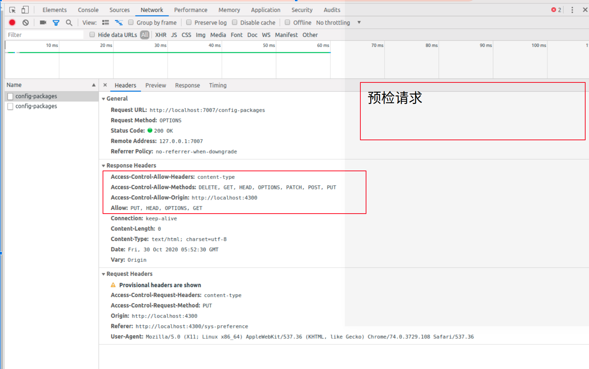

https://www.w3cschool.cn/socket/


socket.io是一个websocket库，包括了客户端的js和服务端的nodejs，它的目标是构建可以在不同浏览器和移动设备上使用的实时应用。它会自动根据浏览器从websocket、ajax长轮询、iframe流等方式中选择最佳的方式来实现网络实时应用。


socket.IO由两部分组成

1、一个服务端用于集成（或挂载）到nodejs HTTP服务器：socket.io

2、一个加载到浏览器中的客户端：socket.io-client

https://www.yinxiang.com/everhub/note/5f033c0e-a565-416d-8878-1c5e094cb9b4


https://juejin.im/post/6844903619465068551


http://www.ruanyifeng.com/blog/2016/04/cors.html

https://segmentfault.com/a/1190000015597029

https://zhuanlan.zhihu.com/p/163644601


## CORS跨域

CORS第一个w3c标准，全称“跨域资源共享（Cross—origin resource sharing）”

允许浏览器向跨源服务器发出“XMLHttpRequest”请求，克服了AJAX只能同源使用的限制。


CORS需要浏览器和服务器同时支持，目前几乎所有的浏览器都支持，这边不需要担心

整个CORS通信过程，都是浏览器自动完成的，不需要用户参与，所以对于开发者来说，重点关注服务器，只要服务器实现了CORS接口，就可以跨源通信。


CORS请求：
1、简单请求（simple request）

（1）请求方法三种之一（HEAD、GET、POST）

（2）HTTP的头信息不草果这几种（Accept、Accept-Language、Content-Language、Last-Event-ID、Content-Type）


2、非简单请求

​	凡是不同时满足上面两种条件，就属于非简单请求

就是对服务器有特殊要求的请求，例如put、delete，或者content-type字段的类型是application/json

非简单请求的CORS，在正式通信之前，增加一次HTTP查询请求，称为“预检”请求


浏览器先询问服务器，当前源是否在服务器的许可名单中，以及可以使用哪些HTTP动词和头信息字段，只有得到肯定答复，浏览器才会发出正式的请求，否则就会报错





### 与JSONP比较

使用目的相同，但是比JSONP更强大

JSONP只支持get请求。


jsonp跨域的原理


在HTML标签里，一些script、img这样的获取资源的标签是没有跨域限制的。jsonp正是利用了这一点，动态生成script


小例子

```js
// 处理成功失败返回格式的工具
const {successBody} = require('../utli') 
class CrossDomain {   
    static async jsonp (ctx) {     
        // 前端传过来的参数     
        const query = ctx.request.query     
        // 设置一个cookies     
        ctx.cookies.set('tokenId', '1')     
        // query.cb是前后端约定的方法名字，其实就是后端直接执行前端定义的这个方法，把想要传递的数据放到参数中，这样的话就可以console出来  
        ctx.body = `${query.cb}(${JSON.stringify(successBody({msg: query.msg}, 'success'))})`   
    } 
} 
module.exports = CrossDomain


```

```html
<!DOCTYPE html> 
<html>   
    <head>     
        <meta charset="utf-8">   
    </head>   
    <body>     
        <script type='text/javascript'>       
            // 后端返回直接执行的方法，相当于执行这个方法，由于后端把返回的数据放在方法的参数里，所以这里能拿到res。       
            window.jsonpCb = function (res) {         
                console.log(res)       
            }     
        </script>     
        <script src='http://localhost:9871/api/jsonp?msg=helloJsonp&cb=jsonpCb' type='text/javascript'></script>   
        // 这个script就是后端的代码，里面有个jsonCb的方法
    </body> 
</html>
```


## 反向代理

 https://blog.csdn.net/m0_37120609/article/details/83757350 


当我们有一个服务器集群，并且服务器集群中的每一台服务器的内容一样的时候，同样我们要直接从个人电脑访问到服务器的时候无法访问，必须通过第三方才能访问集群。

这个时候，我们通过第三方服务器访问集群的内容，但是我们并不知道哪一台服务器提供的内容，此种代理的方式称为反向代理。


### 什么是负载均衡

公司会建立很多服务器，这些服务器组成了服务器集群，然后，当用户访问网站的时候，先访问一个中间服务器，再让这个中间服务器在服务器集群中选择一个压力较小的服务器，然后将该访问的请求引入选择的服务器。（nginx会分配服务器压力小的去向）


### nginx

ngnix是开源的轻量级web服务器、反向代理服务器，已经负载均衡器和HTTP缓存器。其特点是高并发、高性能和低内存

```javascript
// /etc/nginx/conf.d/*.conf;
server {   // 实现反向代理
    listen       80;  // 监督端口号
    server_name  localhost;     // 用指定的域名去访问  虚拟服务器的识别路径

    #charset koi8-r;
    #access_log  /var/log/nginx/host.access.log  main;

    location /en-US/ {
        alias   /home/xyz/xyz_standalone_setup/en-US/;
        try_files $uri$args $uri$args/ /en-US/index.html;
    }

    location /zh-Hans/ {
        alias   /home/xyz/xyz_standalone_setup/zh-Hans/;
        try_files $uri$args $uri$args/ /zh-Hans/index.html;
    }

    set $first_language 'en-US';
    set $language_suffix 'en-US';

    if ($first_language ~* 'zh-Hans') {
        set $language_suffix 'zh-Hans';
    }

    location / {  														// 访问根路径
        rewrite ^/$ http://$server_addr/$language_suffix/ permanent;    //  rewrite与proxy_pass有什么区别   
        															// proxy_pass http://firstdemo 代理到firstdemo里的两个服务器上
    }

    #error_page  404              /404.html;

    # redirect server error pages to the static page /50x.html
    #
    error_page   500 502 503 504  /50x.html;
    location = /50x.html {
        root   /usr/share/nginx/html;
    }
}
```


```javascript
// nginx.conf
user  nginx;
worker_processes  1;   // 工作进程数

error_log  /var/log/nginx/error.log warn;
pid        /var/run/nginx.pid;


events {
    worker_connections  1024;   // 每个进程允许的最大连接数
}


http {
    include       /etc/nginx/mime.types;
    default_type  application/octet-stream;

    log_format  main  '$remote_addr - $remote_user [$time_local] "$request" '
                      '$status $body_bytes_sent "$http_referer" '
                      '"$http_user_agent" "$http_x_forwarded_for"';

    access_log  /var/log/nginx/access.log  main;

    sendfile        on;
    #tcp_nopush     on;

    keepalive_timeout  65;

    #gzip  on;

    include /etc/nginx/conf.d/*.conf;
}
```

